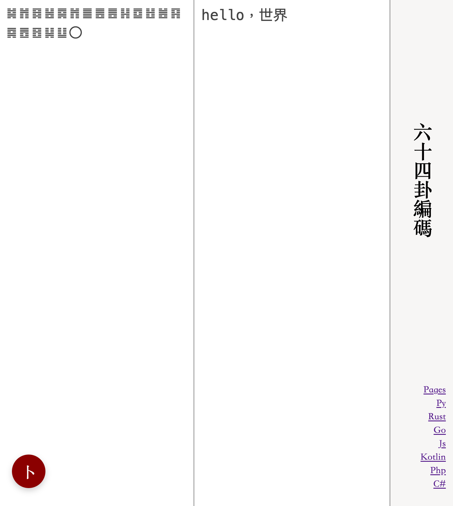

# 六十四卦編碼

六十四卦編碼，rust實現

如：“hello，世界”會編碼為“䷯䷬䷿䷶䷸䷬䷀䷌䷌䷎䷼䷲䷰䷳䷸䷘䷔䷭䷒〇”

[crates](https://crates.io/crates/gua64)

[demo](https://lizongying.github.io/js-gua64/)



## 各語言實現

* [rust](https://github.com/lizongying/rs-gua64)
* [golang](https://github.com/lizongying/go-gua64)
* [js](https://github.com/lizongying/js-gua64)
* [java](https://github.com/lizongying/java-gua64)
* [php-gua64](https://github.com/lizongying/php-gua64)
* [python](https://github.com/lizongying/pygua64)
* [c#](https://github.com/lizongying/dotnet-gua64)

## 引用

```shell
cargo add gua64
```

or

```shell
[dependencies]
gua64="0.0.5"
```

## 示例

```shell
cargo run --example basic_example
```

or

```rust
use gua64::Gua64;

fn main() {
    let gua64 = Gua64::new();

    let message = "hello，世界".as_bytes();
    println!("Original: {:?}", message);

    let encoded = gua64.encode(message);
    println!("Encoded: {}", encoded);

    let decoded = gua64.decode(&encoded);
    println!("Decoded: {:?}", String::from_utf8(decoded).unwrap());

    let is_valid = gua64.verify(&encoded);
    println!("Is valid: {}", is_valid);
}
```

```shell
cargo run
```

## 讚賞

